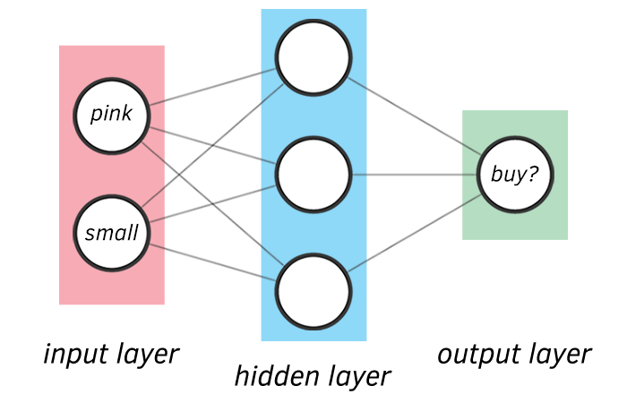

# How to interpret Neural Networks?

Neural networks built from scratch using python for interprebability, we use only one example. Feel free to adjust the functions, or parameters to understand how it works. Provides comments next to backpropagation methods. 

## Prerequisite: 

- Having a reasoning of why derivatives are important for telling us where the minimum lies
- Partial Derivative Chain rule
- Basic Matrix Multiplication + transposing

## Neural Network Usage

- Output node is only fixed to one since this is only a binary neural network
- X's dimensions should be reshaped to # of inputs by # of m (datapoints)
- Number of Hidden layers can be flexible
- Learning rate is adjustable

